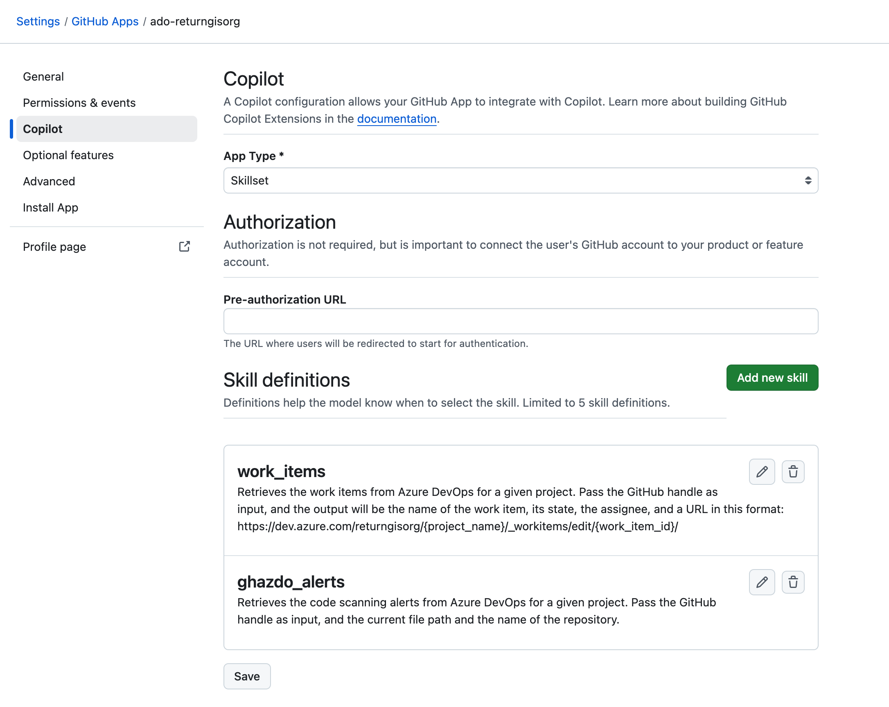

# GitHub Copilot extension for Azure DevOps

Hi developer 👋🏻! This repo is a Proof of Concept to demonstrate that you can integrate GitHub Advanced Security for Azure DevOps and GitHub Copilot using GitHub Copilot Extensions. Thanks to that you can ask to GitHub Copilot Chat for help to fix your vulnerabilities in the IDE! How cool is that!

## How to use it?

You don't need to install anything locally. This repo contains a `.devcontainer/devcontainer.json` file with the configuration to run the project in a Docker container. You just need to open this repo in Visual Studio Code and click on the `Reopen in Container` button.

### Create a `.env` file

First you have to create a `.env` file in the root of the project with the following content:

```bash
ADO_ORG="<YOUR_ADO_ORG>"
ADO_PAT="<YOUR_ADO_PAT>"
```

### Install the dependencies and run the web server

Then you have to install the dependencies:

```bash
npm install
```

And finally you can run the Node.js application:

```bash
npm run start
```

### Run ngrok

To expose the local server to the internet you can use [ngrok](https://ngrok.com/).

You need to add your `auth token` before execute `ngrok`. For that you can go to the [ngrok dashboard](https://dashboard.ngrok.com/get-started/setup) and copy the `auth token`.

Then you can run the following command:

```bash
ngrok config add-authtoken <YOUR_NGROK_AUTH_TOKEN>
```

And now you can run the following command:

```bash
ngrok http 3000
```

### Create a GitHub App

Cool, now that you have the local server running and exposed to the internet you need to create a GitHub App. In my case I created a Github App an Enterprise level but you can create a GitHub App at the organization level, account level, it's up to you.

#### General Settings

You need to provide:

-  `GitHub App Name`, for example `ado-returngisorg`which is the name of my Azure DevOps organization.

- `Homepage URL`, in my case I use the Azure DevOps organization URL, for example `https://dev.azure.com/returngisorg`

- `Callback URL`, for example `https://github.com

#### Permissions

You need to give the following permissions to the GitHub App:


#### Copilot section

For this Github Copilot Extension I used the `Skillset` mode, with a couple of skills:



For now we have the following skills:

- `work_items`: This skill is used to retrieve the work items from Azure DevOps.

- `ghazdo_alerts`: This skill is used to retrieve the alerts from GitHub Advanced Security for Azure DevOps.


In the file `src/app.js` I put as a comment the information that you need to provide to the skills to work.


[!IMPORTANT]
You should replace your ngrok URL with the one that you get when you run `ngrok http 3000`.

## What type of questions can I ask to GitHub Copilot?

For this example what I did was clone of of the repos that I have in  my Azure DevOps organization with some vulns. And I added a `.github/copilot-instructions.md` file with the following content:

```markdown
The Azure DevOps project of this repo is "GHAzDO" and the name of the repo is "shiftleft-java-demo"
```

It's true that custom instructions is not working today with the Copilot Extensions but I hope that at some point It will work.

Then I asked to GitHub Copilot Chat the following question:


- `@ado-returngisorg do I have any vulnerabilities in this repo?`

Answer:


- `@ado-returngisorg can you help me to fix the pom.xml file based on the alerts that I have #file:pom.xml`

Answer - part 1:


Answer - part 2:


- `@ado-returngisorg do I have any alerts for the current file? Please take into account this #file:copilot-instructions.md` (Current file: `AdminController.java`)

Answer:


- `@ado-returngisorg can you help me to fix the first alert? #file:copilot-instructions.md`

Answer:


Tada! 🎉